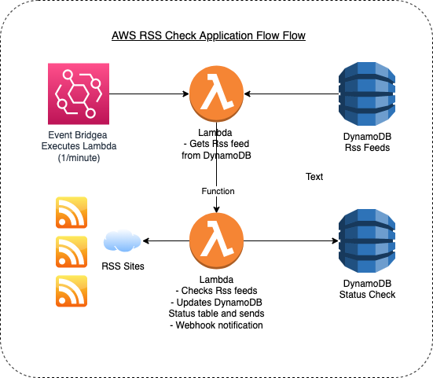

# AWS RSS Checker App

A Node.js app written and public to AWS Lambda using the servless framework (<https://www.serverless.com/>).

## Overview

The Lambda Function reads from a source list of RSS sites within DynamoDB (see example below) and then scans each site for any published status update. As the various providers publish updates to their respective sites, the script will capture the update and send the update to a defined webhook. Additionally, the “sent updates” are written to a DynamoDB table used to eliminate duplicate alerts for the same update.

- Apigee <https://status.apigee.com/history.rss>
- Azure <https://azurestatuscdn.azureedge.net/en-us/status/feed/>
- CloudFlare <https://www.cloudflarestatus.com/history.rss>
- Imperva <https://status.imperva.com/history.rss>
- NewRelic <https://status.newrelic.com/history.rss>

## AWS Resources used in Project

| DynamoDB | Lambda | Event Bridge | Cloudwatch |

## Diagram of the Platform



## Install

1. Download the repo folder to your local machine that is running the latest version of node.js
2. run npm install
3. Setup your Dynamo-DB tables (see below for more details)
4. Create a subfolder under root names \env and then create a file named env.dev.json file (see below env file details)
5. Update the serverless.yml config file with your configs
6. run the sls deploy command

### DynamoDB tables

Create 2 DynamoDB tables with the following configs. One table will be used to start rss feeds to monitor and the second will be used to track and record alerts sent.

#### Status Table Details

1. From the AWS DynamoDB console click Create Table
2. Create the table named "awsrss-status-dev"
3. Create a Partition key named "statusId" and set as a string
4. Keep all the defaults and click Create Table
5. Seed the table with the rss sites to monitor. From the DynamoDB menu click on "Tables\ Explore itmes" and select the table you created
6. Click "Create item" to add the rss feeds you wish to monitor (see below to see list of seed data to use.) **Make sure you use a unique value for the statusId and ensure that the atribute used for the rss feed is named "rssUrl".**

#### Sent Table Details

1. From the AWS DynamoDB console click Create Table
2. Create the table named "awsrss-sent-dev"
3. Create a Partition key named "guidItem" and set as a string
4. Keep all the defaults and click Create Table

### Environment File setup (evn.xxxx.json)

ENV overview;

```json
{
  "ENVIRONMENT": "Enviroment to match deployment used in the serverless.yml file",
  "PROD_HOOK": "MS Teams channel webhooks to send alerts",
  "DYNAMO_TABLE": "name of the status dynamodb table",
  "DYNAMO_SENT": "name of the sent dynamodb table",
  "DATE_OFFSET": "miliseconds offset to use between alerts to avoid dups. Keep default 600000",
  "ARN_STATUS": "arn of the status dynamodb table",
  "ARN_SENT": "arn of the sent dynamodb table"
}
```

Sample Data below;

```json
{
  "ENVIRONMENT": "DEV",
  "PROD_HOOK": "https://notified.webhook.office.com/webhookb2/xxxxx9999999000000333",
  "DYNAMO_TABLE": "aswrss-status-dev",
  "DYNAMO_SENT": "aswrss-sent-dev",
  "DATE_OFFSET": "600000",
  "ARN_STATUS": "arn:aws:dynamodb:us-east-1:1234567890:table/aswrss-status-dev",
  "ARN_SENT": "arn:aws:dynamodb:us-east-1:1234567890:table/aswrss-sent-dev"
}
```

#### Seed Data

```text
statusId	rssUrl
Apigee	https://status.apigee.com/history.rss
Azure	https://azurestatuscdn.azureedge.net/en-us/status/feed/
CloudFlare	https://www.cloudflarestatus.com/history.rss
Imperva	https://status.imperva.com/history.rss
NewRelic	https://status.newrelic.com/history.rss
Acquia	https://status.acquia.com/history.rss
AWS	https://status.aws.amazon.com/rss/all.rss
```
